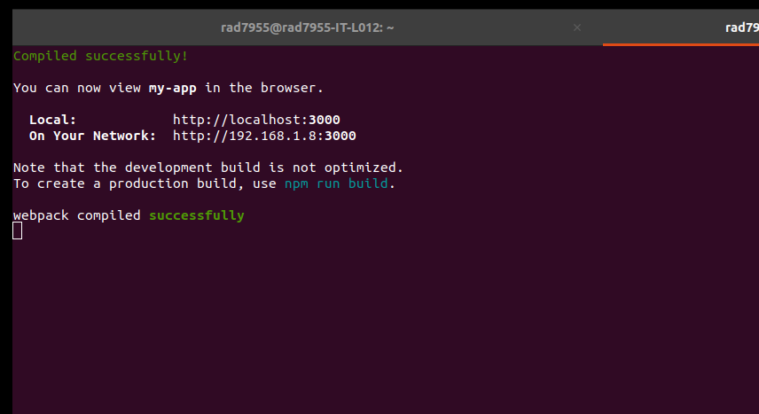
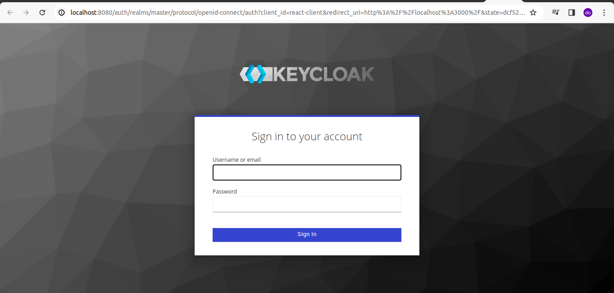
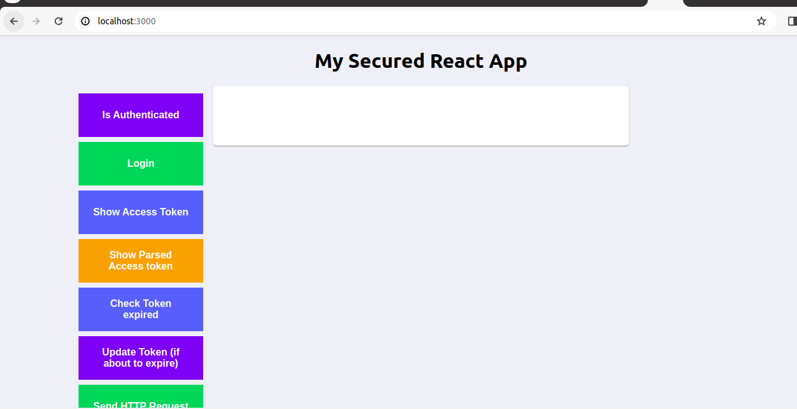

In the project directory, you can run:

### `npm start`

Runs the app in the development mode.\
Open [http://localhost:3000](http://localhost:3000) to view it in your browser.

OUTPUT
--------

Keycloak authorization is required before entering the application. Login with the Keycloak `username` and `password` we created earlier with Keycloak.

After entered the keycloak valid `username` and `password`, we got the reactjs application page !!!!!

1. Client ID                                   - `react-client`
2. Client Type                                 - `OpenID Connect`
3. Client Authentication                       - `Enabled`
4. Authorization                               - `Enabled`
5. OAuth 2.0 Device Authorization Grant        - `Enabled`
6. Root URL                                    - `http://localhost:3000/` (the address of your local API app)
7. Valid Redirect URIs                         - `http://localhost:3000/`
8. Web Origins                                 - `http://localhost:3000/`
9. Go to the advanced setting 
10. Proof Key for Code Exchange Code Challenge - `s256`
11. `Save` it.
