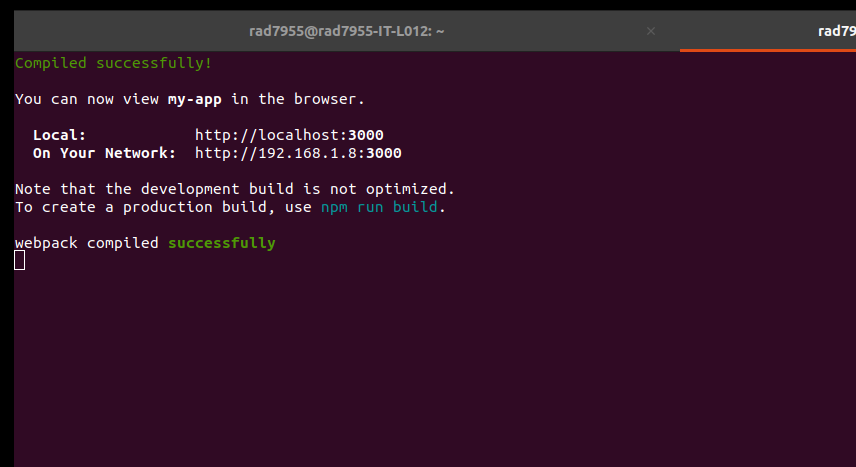
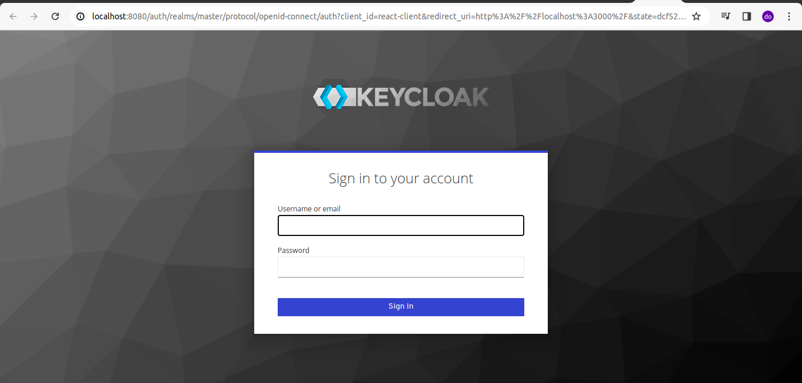

In the project directory, you can run:

### `npm start`

Runs the app in the development mode.\
Open [http://localhost:3000](http://localhost:3000) to view it in your browser.

OUTPUT
--------

Keycloak authorization is required before entering the application. Login with the Keycloak username and password we created earlier with Keycloak.

